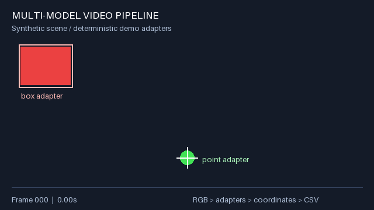
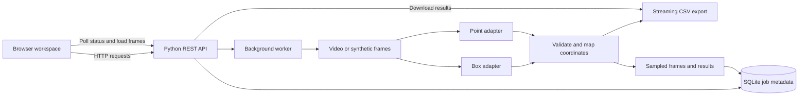

# VisionWeave: Full-Stack Video Analysis Workspace

A local web application for running video analysis, inspecting predictions, and exporting structured results. A browser frontend connects to a Python REST API, a background processing worker, and SQLite job history. Both the web app and the original CLI use the same video-processing pipeline.

**Stack:** JavaScript, HTML/CSS, Canvas, Python, SQLite, NumPy, Pillow, optional OpenCV.



**The demo runs entirely on generated geometric shapes.** The included adapters use deterministic color rules to exercise a two-model integration workflow. They are not trained ML models, and their results do not demonstrate model accuracy.

## What you can do

- Start a synthetic demo or upload a video from your computer.
- Set a frame limit and sampling interval, monitor progress, and cancel a run.
- Inspect sampled frames with independent box and point overlays.
- Browse paginated results and download the complete CSV.
- Revisit saved runs after restarting the server.

## Engineering highlights

- Video ingestion, sequential frame iteration, optional sampling, and timestamps.
- Aspect-preserving resize and padding, RGB conversion, and tensor preparation.
- Independent box and point adapters with different input sizes and one output contract.
- Inverse coordinate transforms, validation, clipping, and normalized coordinates.
- Streaming CSV export, explicit empty results, progress reporting, and resource cleanup.
- Atomic output publication: failed or interrupted runs leave previous results intact.
- A same-origin REST API, background job queue, persistent metadata, and bounded preview storage per run.
- Input validation, upload limits, safe file routing, and cleanup of uploaded source files.

The pipeline design is adapted from a prior video-processing project. This public implementation replaces domain-specific integrations with generic interfaces and new synthetic examples. It contains no trained assets or original research data.

## Browser demo and deployment

The `demo/` directory is a standalone, static browser edition. Visitors can analyze generated frames, inspect box and point overlays, play sampled previews, browse results, and export CSV. Actual pixel detection runs in a Web Worker; no Python server or upload service is needed. The latest eight runs stay in page memory and clear on reload.

This demo uses source-resolution JavaScript detectors. The Python app below uses resized adapter inputs, so coordinates can differ slightly. Both use deterministic color rules, not trained AI models.

To preview locally:

```bash
python3 -m http.server 8001 --bind 127.0.0.1 --directory demo
```

Open http://127.0.0.1:8001. To deploy on Vercel, import this repository, set **Root Directory** to `demo` and **Framework Preset** to **Other**. The included `demo/vercel.json` selects no build command and serves the directory directly. Configure Deployment Protection for your intended audience; a private GitHub repository does not make a deployed website private.

Run the browser engine checks with `node --test tests/browser/engine.test.mjs`. See `demo/README.md` for browser-specific behavior. The Python app is a separate local workflow and is not deployed by this static configuration.

## Run the full-stack app

Requires Python 3.10 or newer. Run these commands from the project folder. The frontend needs no Node installation or build step, and the synthetic demo needs no GPU, weights, or input video.

```bash
python -m venv .venv
source .venv/bin/activate
# Windows PowerShell: .venv\Scripts\Activate.ps1
python -m pip install -r requirements.txt
python -m backend.server
```

Open **[http://127.0.0.1:8000](http://127.0.0.1:8000)** and click **Run analysis**. Keep the terminal running while you use the app. Press Ctrl+C to stop it. If port 8000 is already occupied, start with `python -m backend.server --port 8001` and use the printed address.

To enable uploaded videos, stop the server, install the optional decoder, and restart:

```bash
python -m pip install -r requirements-video.txt
python -m backend.server
```

The interface detects decoder availability and explains when uploads are unavailable. Demo analysis still works without it. Uploads continue to use the included **color-based adapters**, not general object-recognition models.

### Workspace behavior

- Videos are limited to **100 MB**, **600 sampled frames**, and decoded frames at most **4096 pixels on either side**.
- One worker processes jobs sequentially; at most three unfinished jobs can be accepted at once.
- Progress counts frames within the selected limit. A short video can finish before reaching that limit.
- Up to 120 sampled previews are retained per run. Preview playback advances at a fixed inspection speed, not the source video's original timing.
- Original uploaded videos are deleted after processing, cancellation, or failure. JPEG previews, CSVs, and job metadata remain locally under `results/workspace/`.
- Saved results persist across restarts; interrupted jobs become failed rather than silently resuming. The sidebar shows the eight latest jobs; the list API returns up to 30.
- Results are retained until you remove them. To clear all history, stop the server and remove `results/workspace/`. No runtime files are included in the repository package.

**Deployment boundary:** this is a single-user local application. Its standard-library HTTP server binds only to `127.0.0.1`; it has no user accounts or multi-tenant isolation. Do not expose this development server directly to the internet. An online version needs a Python-capable host, production web serving, authentication, storage policies, and a separate worker service. The included frontend cannot process videos if uploaded alone to a static host.

## Original CLI

```bash
python video_pipeline.py --demo --output results/demo.csv
```

The default scene has 120 frames at 30 FPS and produces 240 CSV rows. The red region and green marker disappear on different schedules, including frames with neither present. Empty-result rows keep these frames observable. The supplied [sample CSV](examples/demo.csv) contains the first 60 frames, with 120 rows, including 30 empty results.

To process a local video, install the optional decoder:

```bash
python -m pip install -r requirements-video.txt
python video_pipeline.py --video your_video.mp4 --stride 3 --max-frames 100 --output results/video.csv
```

This command still uses the color-based demo adapters. Connect your own models to perform another task. `--max-frames` counts sampled frames; original frame indices are preserved. Existing output is protected unless `--overwrite` is set. `--progress-every 10` changes the logging interval.

## Architecture



The frontend uses browser-native JavaScript, Canvas, and semantic HTML. It sends actual requests to the Python backend; progress and detections come from the running pipeline. SQLite stores job state, while JPEG previews and CSV files are stored on disk. The server serves both the frontend and API from the same origin.

Each adapter is initialized once per job. For each frame, the pipeline prepares an input at that adapter's requested size, calls `predict()`, validates its results, and converts canvas coordinates into source coordinates. Results are written immediately. The CLI retains one frame's results at a time; the web worker additionally keeps a bounded set of preview metadata.

The two adapters run sequentially on the same frame. A row belongs to one adapter and one prediction. The pipeline does not infer an association between outputs from different adapters, and it does not track objects between frames.

### Project layout

```text
web/                       Browser UI, styles, Canvas rendering, API client
backend/server.py          HTTP endpoints, validation, static files, uploads
backend/jobs.py            Background worker, SQLite persistence, job lifecycle
video_pipeline.py          Shared processing engine and original CLI
tests/test_backend.py      HTTP handler and background-job integration tests
tests/test_pipeline.py     Pipeline and coordinate-transform tests
examples/demo.csv          Results generated from synthetic inputs
assets/demo.gif            Synthetic scene illustration
results/                   Local generated data (ignored by Git)
```

### API

| Method | Route | Purpose |
| --- | --- | --- |
| GET | `/api/health` | Health, decoder availability, upload limit |
| GET | `/api/jobs` | Latest 30 runs without frame payloads |
| POST | `/api/jobs/demo` | Start a synthetic job with JSON `{"max_frames": 120}` |
| POST | `/api/jobs/video?name=clip.mp4&max_frames=120&stride=1` | Upload raw file bytes as `application/octet-stream` |
| GET | `/api/jobs/{id}` | Job status, counts, and sampled frame metadata |
| POST | `/api/jobs/{id}/cancel` | Request cancellation |
| GET | `/api/jobs/{id}/results?offset=0&limit=20` | Paginated results after completion |
| GET | `/api/jobs/{id}/frames/{index}.jpg` | A retained preview frame |
| GET | `/api/jobs/{id}/csv` | Download the completed CSV |

Mutation requests require `X-VisionWeave-Request: 1`. The server validates the local Host and Origin and does not enable cross-origin access. This protects the local workflow; it is not a substitute for authentication on a public deployment. Upload requests use a raw body to avoid holding the whole file in memory or adding a multipart parser.

The UI optionally exposes `start_demo_analysis` and `get_selected_analysis_status` to browsers supporting the experimental imperative WebMCP API. Unsupported browsers use the normal interface.

## Connect your own models

Implement the `Detector` protocol in `video_pipeline.py` and register your instances in `build_detectors()`. The integration point is marked `MODEL INTEGRATION`.

| Member | Contract |
| --- | --- |
| `name` | Unique source name written into the CSV |
| `input_size` | Positive square input size owned by the adapter |
| `predict(frame)` | Return a sequence of `Prediction` objects; use an empty sequence for no results |
| `frame.rgb` | Padded RGB image, HWC uint8 |
| `frame.tensor` | RGB float32 tensor, shape `1 × 3 × H × W`, scaled to `[0, 1]` |
| `Prediction.xyxy` | Coordinates in the padded input canvas, before inverse mapping |

Load the model in the adapter constructor. Apply your model's required normalization and inference settings inside `predict()`. Decode framework-specific outputs there, including conversion from normalized coordinates into input-canvas coordinates. Return generic labels and optional confidence/visibility values. No particular architecture, framework, number of classes, or number of points is required.

For points, repeat the coordinate as `(x, y, x, y)`. Model confidence and visibility are separate fields; neither is inferred from the other. Demo adapters leave confidence blank because color rules do not produce calibrated probabilities.

## CSV schema

| Columns | Meaning |
| --- | --- |
| `frame_index`, `timestamp_sec` | Zero-based source index and time estimate; unknown time is blank |
| `frame_width`, `frame_height` | Source dimensions in pixels |
| `adapter`, `prediction_index` | Adapter name and zero-based prediction position within that frame and adapter |
| `kind`, `label` | `box`, `point`, or `empty`; descriptive adapter label |
| `confidence`, `visible` | Optional score in `[0,1]`; optional `1`/`0` flag |
| `x1`, `y1`, `x2`, `y2` | Source-image coordinates after inverse resize/padding and clipping |
| `x1_norm`, `y1_norm`, `x2_norm`, `y2_norm` | Source coordinates divided by width or height |

Coordinates use a continuous image-edge convention: x spans `[0, width]` and y spans `[0, height]`. Thus a right edge can equal the width; it is not an array index. The transform uses the actual rounded resize width and height, avoiding errors from reusing a nominal scale after rounding. Predictions outside the image are clipped to its boundary, including points in padding; this does not change their reported visibility.

An adapter with no detections emits one `empty` row with blank prediction fields. There is no forced pairing, fixed point count, or fabricated zero-valued detection. Invalid adapter coordinates and scores fail the run rather than silently producing misleading output.

## Checks

```bash
python -m unittest discover -s tests -v
```

Tests cover coordinate round trips, known synthetic positions, variable prediction counts, empty results, invalid predictions, CLI validation, sampling, and output preservation. Backend tests exercise the real HTTP parser/handlers with an in-memory connection and the actual background worker: job creation, preview images, pagination, CSV download, cancellation, restart recovery, cross-origin rejection, upload cleanup, and failed runs.

Two optional integration tests encode synthetic video, decode it, and exercise the CLI pipeline and uploaded-video API. They are skipped when OpenCV is absent. GitHub Actions installs video dependencies and runs the suite on Python 3.10 and 3.12, checks frontend JavaScript syntax, and runs a real loopback HTTP smoke test. See [verification notes](VERIFICATION.md) for what was actually executed during development.

## Design limits

- Video timestamps are `frame_index / FPS` estimates. Exact variable-frame-rate timing needs a decoder that exposes presentation timestamps.
- Video decoding stops when the decoder cannot return another frame. OpenCV does not reliably distinguish end-of-file from a truncated or corrupt stream here.
- Demo rules expect one red region and one green marker. Multiple same-color regions are merged, and arbitrary video content will not yield meaningful semantic detections.
- Each analysis job uses sequential CPU preprocessing and adapter execution. Jobs run in a background worker so the UI remains responsive. GPU batching, parallel inference, and tracking are not implemented.
- Output publication assumes a local filesystem supporting atomic replacement and hard links. Partial runs are discarded; resuming is not implemented.

Only synthetic examples are included. Keep private media, credentials, model assets, and generated outputs outside source control; the provided ignore rules help prevent accidental additions.
